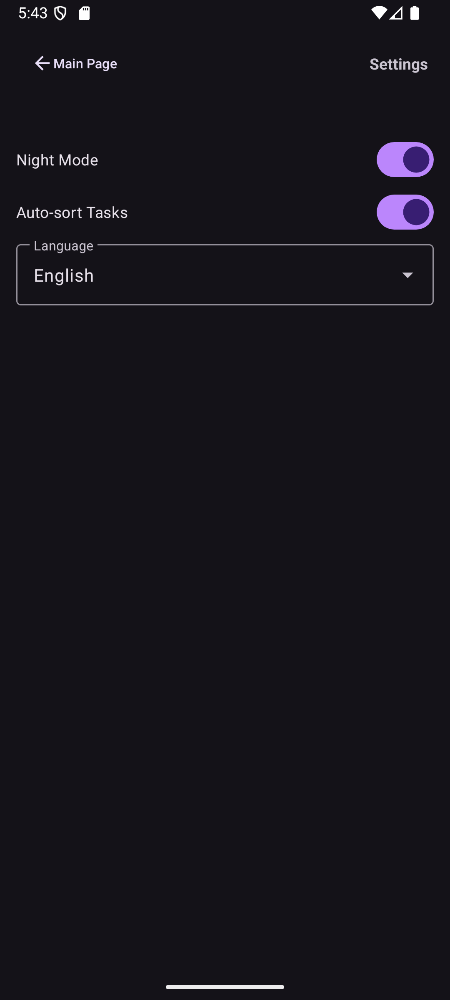

# 🧠 TaskMate
### A minimal, fast, elegant task manager for Android — built with Material You & OneUI-inspired design.

TaskMate is a lightweight and beautifully polished to-do manager designed for clarity and speed.  
Built in Kotlin with modern Android architecture, it combines simplicity with powerful features such as auto-sorting, swipe gestures, archiving, localization, and dark mode.

---

## ✨ Features

### ✔ Minimal & distraction-free UI
A clean layout using Material Design 3 + Material You dynamic colors.

### ✔ Fast task management
- Add tasks quickly via bottom-sheet editor
- Edit tasks in-place
- Smart timestamps (Today, Yesterday, This Week, Old)

### ✔ Smart task organization
- Auto-sort: automatically moves completed tasks to the bottom
- Swipe gestures:
    - ➡️ Archive task
    - ⬅️ Delete task
- Archive page with undo support

### ✔ Beautiful animations
- Fade-in list animations
- Checkbox bounce animation
- Smooth swipe backgrounds

### ✔ Personalization
- Dark / Light mode with saved preferences
- English & Persian full localization
- Automatic RTL/LTR alignment
- Custom circular checkboxes
- Material dynamic colors support

### ✔ Reliability
- Tasks stored locally on the device (no internet required)
- Fully offline & privacy-friendly
- Works across app restarts

---

## 📸 Screenshots

<div align="center">



</div>


---

## 📦 Installation

### **F-Droid (coming soon)**
TaskMate will be available on F-Droid after submission.

### **Manual APK**
Download the latest release from the **Releases** page:  
👉 https://github.com/Amirhossein77-98/taskmate/releases

---

## 🛠️ Build from source

### Requirements
- Android Studio Ladybug or newer
- Kotlin
- Gradle 8+
- Android SDK 24+

### Build steps

```bash
git clone https://github.com/Amirhossein77-98/taskmate.git
cd taskmate
./gradlew assembleDebug
````

### The APK will be located in:
```asgl
app/build/outputs/apk/debug/
```

---

## 📁 Project Structure:

```agsl
app/
├── java/com/amirsteinbeck/taskmate/
│   ├── MainActivity.kt
│   ├── TaskAdapter.kt
│   ├── ArchivedTasksActivity.kt
│   ├── SettingsActivity.kt
│   ├── helpers/
│   │    ├── StorageHelper.kt
│   │    ├── LocaleHelper.kt
│   │    ├── SettingsHelper.kt
│   │    └── NavigationHelper.kt
│   └── models/
│        └── Task.kt
├── res/
│   ├── layout/
│   ├── values/
│   └── drawable/
└── AndroidManifest.xml

```

---

## 📁 Privacy:
TaskMate is built with privacy in mind:
- ❌ No internet access
- ❌ No trackers
- ❌ No analytics
- ❌ No cloud storage
- ✔️ All data is stored **locally on the device**

---

## 📄 License:
This project is licensed under the MIT License.
See the LICENSE file for full details.

---

## 🤝 Contributing:
Contributions are welcome!
You can help improve TaskMate by:
- Reporting bugs
- Suggesting features
- Contributing translations (especially RTL languages)
- Improving UI/UX
- Cleaning or optimizing code

## ⭐ Support
If you enjoy TaskMate, consider:
- Starring the repo ⭐
- Sharing the app with others
- Opening Issues for feature ideas or feedback

## 🙌 Author
Amirhossein Gholizadeh
GitHub: https://github.com/Amirhossein77-98
Instagram / YouTube: DailySkillSeeker